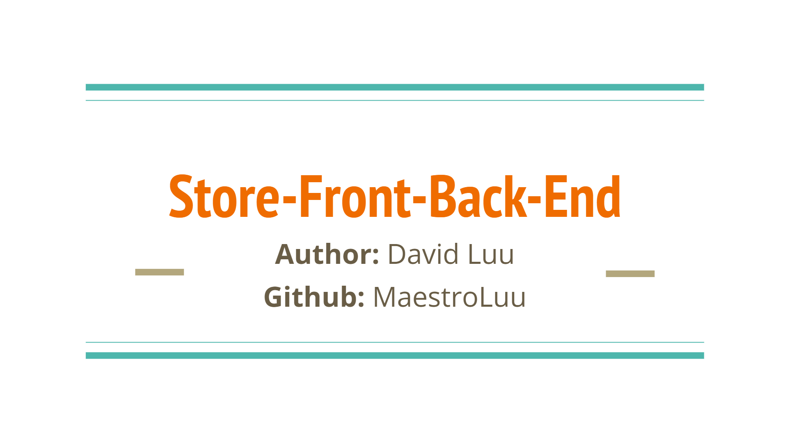

# StoreFront-BackEnd

## Description

This application allows clients to create a logistics database with data regarding their inventory supply, pricing, and categorization of associated tags. This application is entirely back-end functionality and as such, clients will need to utilize a framework that allows them to test this RESTful API.

## [Try it yourself!](https://github.com/MaestroLuu/StoreFront-BackEnd.git)

## Installation

In order for the application to function properly, users must install either Insomnia, Postman, or any other 3rd framework that allows tesing of RESTful APIs. Users can install the Insomnia application by going to the [Insomnia](https://insomnia.rest/download) web page and downloading from the links there. Otherwise, users can also utilize [Postman](https://www.postman.com/) for free on their web browser without the need to directly download the application. They will need to create a free account in order to access these features. The rest of this application requires just an installation of the npm packages and an updated .env with the users credentials.

## Usage

To use this application, users must first access mysql and run the 'schema.sql' from the 'db' directory. After completing that task, users would need to enter 'node run seed' in their terminal to properly populate the database. Once completed, they can enter 'npm start' in their terminal and the application will listen to requests on "localhost:3001". Users can review the appropriate routes within the 'routes' directory and select which route they would like to preview. 

## Technology

- JavaScript 
- NodeJS 
- MySQL2 
- Sequelize 
- Dotenv 
- Express

## Credits

I want to thank the following developers for providing feedback and review during the development of this application:  
- Github: [Marco Flores](https://github.com/JaggedComet/) 

I utilized the NPM packages express, mysql2, sequelize, and dotenv for this project. Their links to the packages can be found below: 
- https://www.npmjs.com/package/express 
- https://www.npmjs.com/package/mysql2  
- https://www.npmjs.com/package/sequelize 
- https://www.npmjs.com/package/dotenv

## Questions

If you have any additional questions regarding this application, please contact me via the channels provided below: 
Github: https://github.com/MaestroLuu 
Email: DLuu.developer@gmail.com